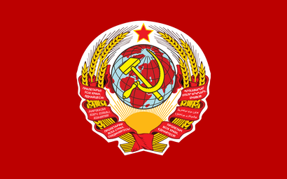
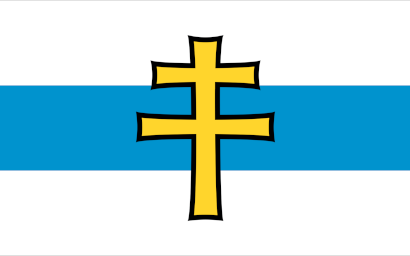

# Flag Pack - Ideology

## About

This Starsector mod adds flags and crests for all kinds of Ideologies. We don't discriminate here. I don't have any specific sources for these flags. I just scavenge them off the internet. However you can check the [Wikimedia page for Ideology flags](https://commons.wikimedia.org/wiki/Political_flags).
This mod is for those who wish to roleplay as certain ideologies or to personalize their colonies. It includes country flags with ideological symbols such as the iron cross, the hammer and sickle, the star and crescent, certain runic symbols and many more.

Please note that I do not endorse these Ideologies and their acts. But if I am going to roleplay as a Space dictator, then I sure as hell want the appropriate flag to go with it. If there is a particular flag you want added to the mod, then please create an [Issue on GitHub](https://github.com/WolframSegler/Flag_Pack-Ideology/issues) and include a high resolution picture if avaliable. Try to find pictures with at least a resolution of 384×256, otherwise the picture looks blurry.

## Modification Instructions

<h4>Adding Flags</h4>
<ul>
    <li>Give a unique name to your flag. Make sure not to include "flag" or "crest" in it. Lastly, add the "flag" suffix at the end.</li>
    <li>Edit your flag to have a resolution of exactly 410×256 pixels. You can use free tools like Gimp or free websites for this.</li>
    <li>Now create a copy of your flag and replace the suffix with "crest". Everything else about the name must stay the same.</li>
    <li>The crest must have a resolution of 256×256 pixels. This can be achieved by cutting the sides of the flag.</li>
    <li>navigate to "Flag_Pack-Ideology/graphics/factions/custom/" and paste your flag and crest here.</li>
    <li>navigate back to Flag_Pack-Ideology and open a terminal on this folder. Powershell also works.</li>
    <li>Paste the following command and hit enter:</li>
    <ul><li>py parser.py ./</li></ul>
    <li>This step might require the installation of python, because I don't know how to use bash.</li>
    <li>The script should should create the new "player.faction" file which includes all the pictures inside the custom folder.</li>
</ul>
Optionally, the player.faction file under Flag_Pack-Ideology/data/world/factions can be edited manually. The syntax is very simple and intuitive. Congratulations, you added your very own flag!

	
